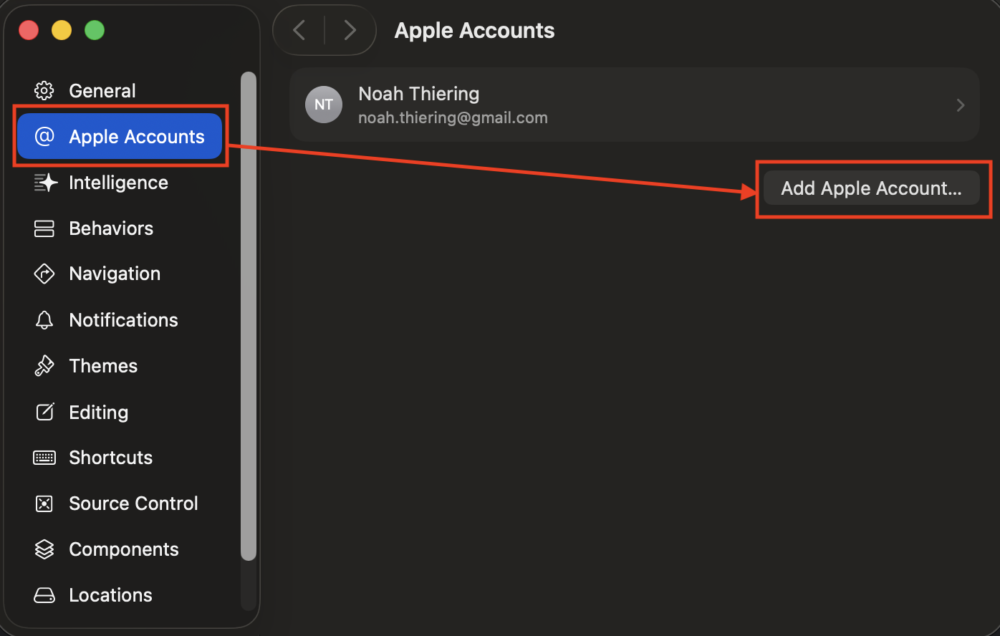
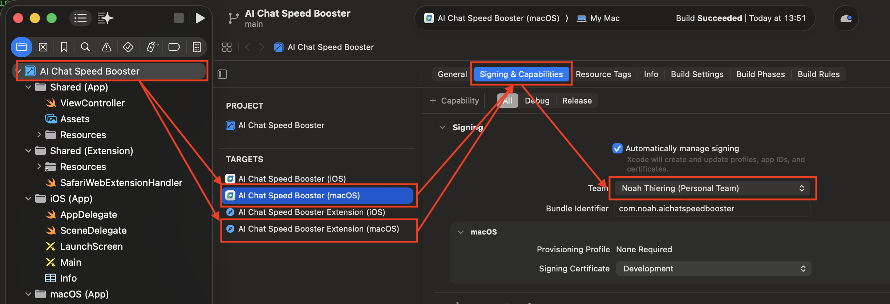

# Safari install guide

Safari requires building the extension yourself using Xcode. You will need a free Apple ID — no paid developer account required.

## Requirements

- macOS
- [Xcode](https://apps.apple.com/app/xcode/id497799835) (free, from the App Store)
- [Node.js](https://nodejs.org) (v18 or later)
- A free Apple ID

---

## Steps

### 1. Clone the repo and install dependencies

```bash
git clone https://github.com/Noah4ever/ai-chat-speed-booster
cd ai-chat-speed-booster
npm install
```

### 2. Build the Safari extension files

```bash
npm run safari:setup
```

### 3. Open the Xcode project

```bash
open "safari-app/AI Chat Speed Booster/AI Chat Speed Booster.xcodeproj"
```

### 4. Add your Apple ID to Xcode

This is required so Xcode can sign the app. You only need to do this once.

1. In Xcode, open **Settings** (⌘,)
2. Go to the **Accounts** tab
3. Click **Add Apple Account...** and sign in with your Apple ID



### 5. Set your Team on the macOS targets

You need to do this for both the app and the extension target.

1. In the left sidebar, click on the **AI Chat Speed Booster** project (the top item)
2. Under **TARGETS**, select **macOS (App)**
3. Open the **Signing & Capabilities** tab
4. Under **Team**, select your name from the dropdown (it will say "Personal Team")
5. Repeat steps 2–4 for the **macOS (Extension)** target



> If Xcode shows a "Failed to register bundle identifier" error, click **Try Again** — it usually resolves on its own.

### 6. Run the app

Make sure the selected scheme in the top bar shows **macOS (App)** and **My Mac**, then click the **Run** button (▶).


Xcode will ask for your **Mac login password** to access the keychain for code signing — this is the same password you use to unlock your Mac.

### 7. Enable the extension in Safari

After the app launches, it will show a prompt telling you to enable the extension in Safari.


1. Open **Safari → Settings → Extensions**
2. Check the box next to **AI Chat Speed Booster** to enable it


### 8. Allow the extension on your AI chat sites

Click the extension icon in the Safari toolbar and allow it to run on the sites you use (e.g. chatgpt.com, claude.ai).
